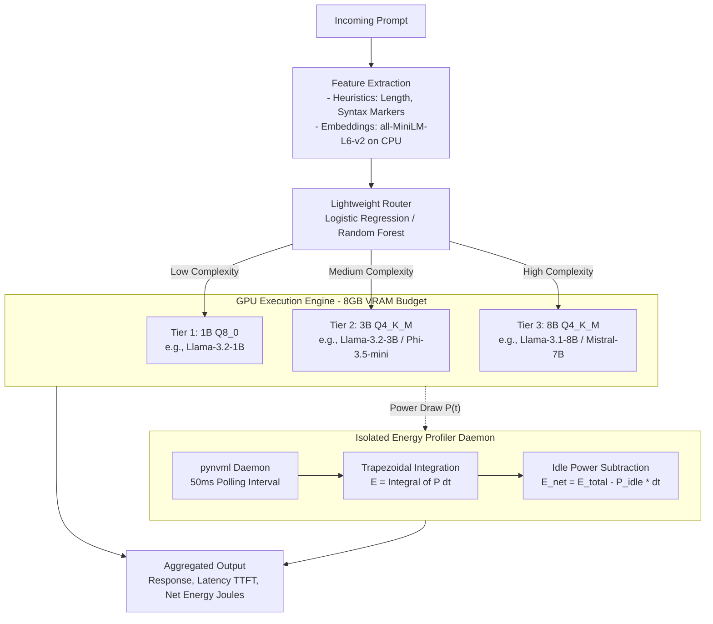

# LLM Energy Benchmark & Adaptive Routing Harness

An empirical measurement framework and adaptive prompt-complexity router designed to benchmark, analyze, and optimize GPU electrical energy consumption during Large Language Model (LLM) inference under constrained consumer hardware environments.

Based on the research: *"A Comparative Analysis of Energy Efficiency Across Large Language Models"* (Talha et al., United International University).

---

## Overview

Modern AI serving systems frequently direct all incoming user requests to large-scale frontier models regardless of query complexity. While effective for difficult tasks, this uniform routing strategy causes severe energy and computational inefficiencies for simpler queries (such as sentiment analysis, short factual extraction, or basic formatting) that can be handled with comparable accuracy by smaller, quantized models.

This project implements an end-to-end empirical measurement and routing harness that:
- **Directly Profiles Real-Time GPU Energy**: Samples GPU power draw at high frequencies via the NVIDIA Management Library (`pynvml`), isolating idle power to calculate net dynamic inference energy.
- **Categorizes Models by Capability Tiers**: Deploys a tiered candidate pool across 1B, 3B, and 8B parameter scales and varying quantization levels within a strict 8 GB consumer VRAM budget.
- **Dynamically Routes Prompts**: Employs a CPU-based, lightweight prompt-complexity classifier to dispatch queries to the minimal adequate model tier, minimizing energy and latency overhead while preserving response quality.
- **Evaluates Trade-offs**: Assesses total energy consumption, energy per token (Joules/token), Quality Preservation Ratio (QPR), and microarchitectural scaling across GPU generations (Ada Lovelace vs. Ampere).

---

## Architecture & System Pipeline

The system connects incoming queries, a feature-extraction and classification router, local GGUF/Ollama model execution engines, and an isolated NVML energy profiler daemon:



---

## Experimental Methodology

### 1. Hardware Platforms & VRAM Constraints

Benchmarking targets two dedicated consumer GPU platforms under a strict 8 GB VRAM budget to study microarchitectural energy scaling:

| Platform | Architecture | Process Node | VRAM | TDP |
| :--- | :--- | :--- | :--- | :--- |
| **Platform A** | NVIDIA GeForce RTX 4060 | Ada Lovelace (TSMC 4N) | 8 GB GDDR6 | 115 W |
| **Platform B** | NVIDIA GeForce RTX 3060 Ti | Ampere (Samsung 8nm) | 8 GB GDDR6 | 200 W |

### 2. Model Candidate Pool & Quantization Tiers

Quantized GGUF models are executed locally (via Ollama or llama.cpp) to operate within the 8 GB VRAM constraint:

| Tier | Scale & Quantization | Target Models | VRAM Footprint | Target Workload Complexity |
| :--- | :--- | :--- | :--- | :--- |
| **Tier 1 (Lightweight)** | 1B, 8-bit (`Q8_0`) | `Llama-3.2-1B-Instruct` | ~1.3 GB | Binary sentiment classification, intent detection, short fact extraction |
| **Tier 2 (Intermediate)** | 3B–3.8B, 4-bit (`Q4_K_M`) | `Llama-3.2-3B-Instruct`, `Phi-3.5-mini-3.8B` | ~2.6–3.1 GB | Multi-sentence summarization, JSON transformation, single-step queries |
| **Tier 3 (Heavyweight)** | 7B–8B, 4-bit (`Q4_K_M`) | `Llama-3.1-8B-Instruct`, `Mistral-7B-Instruct-v0.3` | ~5.2–5.8 GB | Multi-step mathematical reasoning, code synthesis, complex contextual deduction |

### 3. Power Measurement Protocol

Dynamic power draw $P(t)$ is continuously sampled at 50 ms intervals using NVIDIA Management Library (`pynvml`) in an isolated background daemon thread to eliminate inference contention.

- **Total Energy Integration ($E_{\text{total}}$)**: Integrated numerically using the trapezoidal rule over execution duration $[0, T]$:
  $$E = \sum_{k=1}^{N-1} \frac{P(t_k) + P(t_{k+1})}{2} \cdot (t_{k+1} - t_k)$$

- **Idle Power Baseline ($P_{\text{idle}}$)**: Profiling runs for 3 seconds before each test batch to measure baseline power.

- **Net Dynamic Energy ($E_{\text{net}}$)**:
  $$E_{\text{net}} = E_{\text{total}} - (P_{\text{idle}} \times \Delta t_{\text{latency}})$$

> [!IMPORTANT]
> Always profile $P_{\text{idle}}$ under resting conditions prior to initiating inference requests to avoid skewing dynamic energy calculations.

### 4. Lightweight Prompt-Complexity Router

The router decides the minimal adequate model tier per query while keeping routing overhead ($\Delta t_{\text{route}}, \Delta E_{\text{route}}$) negligible:

1. **Feature Extraction (Host CPU)**:
   - Surface heuristics: prompt token length, character count, code syntax markers (`def`, `class`, `import`, `curl`, SQL keywords).
   - Dense semantic embeddings: 384-dimensional vector extracted via `all-MiniLM-L6-v2` (22M parameters) on CPU.
2. **Tier Classification**:
   - Multi-class classifier (Logistic Regression with $L_2$ regularization or Random Forest) predicting target tier $\hat{y} \in \{\text{Tier 1}, \text{Tier 2}, \text{Tier 3}\}$.

### 5. Benchmark Workload Distribution

The evaluation suite comprises a balanced workload of 600 prompts (200 prompts per complexity class):

- **Low-Complexity (200 prompts)**:
  - **SST-2**: Binary sentiment classification
  - **SQuAD v2.0**: Closed-domain fact retrieval
- **Medium-Complexity (200 prompts)**:
  - **CNN/DailyMail**: Multi-sentence abstractive summarization
  - **MNLI**: Multi-genre natural language inference
- **High-Complexity (200 prompts)**:
  - **GSM8K**: Multi-step grade-school mathematical reasoning
  - **HumanEval**: Python functional code synthesis

### 6. Evaluation Metrics

1. **Energy Efficiency**:
   - Total Electrical Energy: $E_{\text{total}}$ (in kJ)
   - Energy per Output Token: $\text{Joules/Token} = E / N_{\text{tokens}}$
   - Microarchitectural Scaling Ratio: $\eta = E_{\text{RTX 3060 Ti}} / E_{\text{RTX 4060}}$
2. **Quality Retention**:
   - Evaluated using Accuracy / Exact Match (EM) for classification/QA, ROUGE-L for summarization, and Pass@1 for code generation.
   - **Quality Preservation Ratio (QPR)** relative to the static 8B baseline:
     $$\text{QPR} = \frac{\text{Score}_{\text{Router}}}{\text{Score}_{\text{Tier 3 Static}}} \times 100\%$$
3. **Latency Profile**:
   - Time-to-First-Token (TTFT)
   - End-to-End Latency
   - Router Overhead ($\Delta t_{\text{route}}$)

---

## Project Structure

```text
LLM_Energy_Benchmark/
├── AGENTS.md                  # Detailed guidelines and protocols for autonomous agents
├── README.md                  # Project documentation and methodology
├── requirements.txt           # Python dependencies (pynvml, sentence-transformers, etc.)
├── Tier_1/                    # Tier 1 experiments (1B Q8_0)
│   ├── check_model.ipynb      # Verification of loaded Ollama instance
│   ├── GPU_power.ipynb        # Basic NVML power verification
│   └── Measuring_ai.ipynb     # Interactive energy measurement harness
└── Tier_2/                    # Tier 2 experiments (3B Q4_K_M)
    ├── check_model.ipynb      # Verification of Tier 2 model
    ├── GPU_power.ipynb        # NVML test harness
    └── Measuring_ai.ipynb     # Tier 2 energy benchmarking notebook
```

---

## Prerequisites & Installation

### Hardware & System Requirements
- NVIDIA GPU with compatible proprietary drivers supporting NVML (CUDA 12+).
- Python 3.10+ virtual environment.
- [Ollama](https://ollama.com/) or a local GGUF server listening on port `11434`.

### 1. Environment Setup

Clone the repository and install required packages inside an active virtual environment:

```bash
# Clone the repository and switch to docs branch
git clone <repository_url>
cd LLM_Energy_Benchmark
git checkout docs

# Create and activate virtual environment
python3 -m venv .venv
source .venv/bin/activate  # On Windows: .venv\Scripts\activate

# Install dependencies
pip install -r requirements.txt
```

### 2. Pull Required Models

Pull the candidate models into your local Ollama instance:

```bash
# Tier 1
ollama pull llama3.2:1b

# Tier 2
ollama pull llama3.2:3b
ollama pull phi3.5:3.8b

# Tier 3
ollama pull llama3.1:8b
ollama pull mistral:7b
```

Verify that the models are loaded:
```bash
ollama ps
```

---

## Usage Guide

### Basic Energy Measurement Example

The following script profiles baseline idle power, executes an inference request, monitors dynamic power via NVML every 50 ms, and computes net dynamic energy using trapezoidal integration:

```python
import time
import threading
import requests
from pynvml import nvmlInit, nvmlDeviceGetHandleByIndex, nvmlDeviceGetPowerUsage, nvmlShutdown

nvmlInit()
handle = nvmlDeviceGetHandleByIndex(0)

def get_power_watts():
    return nvmlDeviceGetPowerUsage(handle) / 1000.0

def measure_idle_power(seconds=3):
    readings = []
    start = time.perf_counter()
    while time.perf_counter() - start < seconds:
        readings.append(get_power_watts())
        time.sleep(0.05)
    return sum(readings) / len(readings)

def power_monitor(samples, stop_event):
    while not stop_event.is_set():
        samples.append((time.perf_counter(), get_power_watts()))
        time.sleep(0.05)

def calculate_energy(samples):
    energy = 0.0
    for i in range(1, len(samples)):
        t1, p1 = samples[i - 1]
        t2, p2 = samples[i]
        energy += ((p1 + p2) / 2.0) * (t2 - t1)
    return energy

# 1. Profile idle power
p_idle = measure_idle_power(seconds=3)

# 2. Start monitoring daemon
samples = []
stop_event = threading.Event()
monitor_thread = threading.Thread(target=power_monitor, args=(samples, stop_event))
monitor_thread.start()

# 3. Execute inference request
start_time = time.perf_counter()
res = requests.post(
    "http://localhost:11434/api/generate",
    json={"model": "llama3.2:1b", "prompt": "Summarize the carbon footprint of AI.", "stream": False}
)
latency = time.perf_counter() - start_time

# 4. Stop monitor and compute metrics
stop_event.set()
monitor_thread.join()

total_energy = calculate_energy(samples)
net_energy = total_energy - (p_idle * latency)

print(f"Latency: {latency:.2f} s | Total Energy: {total_energy:.2f} J | Net Energy: {net_energy:.2f} J")
nvmlShutdown()
```

> [!TIP]
> When executing multi-batch benchmark runs, ensure adequate cool-down delays (e.g. 5–10 seconds) between queries to allow GPU temperatures and power draws to return to stable idle levels.

---

## Research Citation

If you use this benchmark harness, router architecture, or methodology in your work, please cite:

```bibtex
@article{talha2026comparative,
  title={A Comparative Analysis of Energy Efficiency Across Large Language Models},
  author={Talha, Fatin Israq and Borno, Mehrab Sadekin and Rabbi, Md Rakib Hasan and Prianto, Muhmmad Ahamadul Hasan},
  journal={Department of Computer Science and Engineering, United International University},
  year={2026}
}
```
